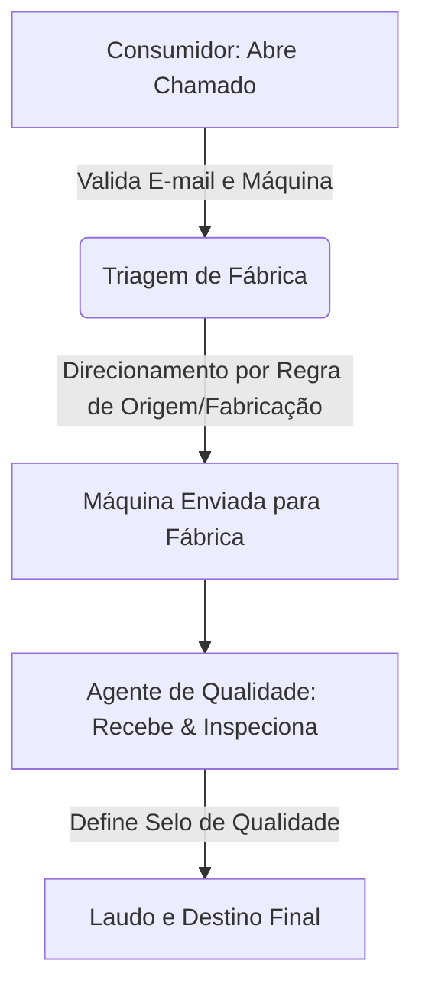

# MachineReturnProto 🤖📦

Este repositório é um protótipo e laboratório projetado para testar e avaliar a capacidade e comportamento de agentes de Inteligência Artificial no desenvolvimento de software de nível corporativo.

---

## 🎯 Objetivo do Projeto

Embora o projeto implemente um domínio de negócios real, seu propósito principal é duplo:

1. **Parte 1: Avaliação de Skills e Rules com Tessl (Fase Atual):**
   Testar como os modelos de IA e assistentes de codificação (como o Antigravity) interpretam, consomem e obedecem a diretrizes modulares, regras específicas e habilidades (*skills*) estruturadas e instaladas usando o ecossistema do **Tessl**.
2. **Parte 2: Codificação com Devin AI:**
   Validar o comportamento e eficácia de agentes totalmente autônomos de engenharia de software (especificamente o **Devin AI**) ao ler a especificação inicial, obedecer a arquitetura proposta e codificar a solução de ponta a ponta sem intervenção humana direta na lógica.

---

## 🏢 O Domínio de Negócio: MachineReturn

O domínio simulado é a **Logística Reversa de Máquinas Corporativas**. O sistema gerencia a devolução de computadores/equipamentos por fim de contrato ou defeito, realizando a triagem automatizada para fábricas e inspeção de qualidade.

### Fluxo Principal



### Principais Entidades (DDDD)

* **Usuario e Perfil:** Diferenciação entre perfis com login (`AgenteQualidade`) e sem login (`Consumidor`).
* **Maquina:** Identificada por código único, número de série, ano de fabricação, país de origem e o usuário atribuído. Mantém o histórico de selos de qualidade.
* **ChamadoDevolucao:** Ciclo de vida (`Aberto`, `EmTransito`, `Recebido`, `Inspecionado`, `Finalizado`).
* **Fabrica:** Destinos físicos operacionais (ex: Fábrica de Descarte Internacional, Fábrica de Manutenção Avançada).
* **LaudoQualidade:** Averiguação do Agente de Qualidade, atribuindo selos como `Novo`, `UsadoEmBoasCondicoes`, `NecessitaManutencao`, `Descartar`, etc.

---

## 🏛️ Arquitetura do Sistema (.NET 8)

A aplicação segue uma estrutura de **Clean Architecture** combinada com **Vertical Slice Architecture** para os casos de uso:

1. **Domain:** Entidades ricas e invariantes de negócio.
2. **Application:** Casos de uso orquestrados por fatias verticais (*features*).
3. **Infra:** Persistência de dados (PostgreSQL via EF Core) e infraestrutura de cache (Redis).
4. **API:** Entrada do sistema exposta via Minimal APIs e Controllers do ASP.NET Core 8.
5. **Shared:** Middlewares globais (ex: tratamento semântico de erros e RFC 7807 Problem Details).

---

## 🛠️ Ecossistema Tessl & Customizações de IA

O comportamento dos agentes de IA é guiado por regras modulares instaladas pelo [Tessl](https://tessl.io). As configurações do projeto estão mapeadas no arquivo [tessl.json](tessl.json) e as diretrizes principais em [AGENTS.md](AGENTS.md).

### Dependências Locais de Engenharia de Prompt (Plugins)

As regras de comportamento de IA e *skills* são organizadas como plugins locais no projeto:

* [plugins/sdd-workflow](plugins/sdd-workflow): Workflow de Desenvolvimento Baseado em Especificações (*Spec-Driven Development*).
* [plugins/dotnet-clean-arch](plugins/dotnet-clean-arch): Diretrizes para arquitetura limpa em .NET 8, higiene de Git, gerenciamento de segredos e aprovação de comandos.

### Fontes de Regras Unificadas

* [AGENTS.md](AGENTS.md): O hub central de regras consumido pelas IAs.
* [.tessl/RULES.md](.tessl/RULES.md): Regras sincronizadas do Tessl que apontam para arquivos de regras de plugins individuais.

---

## 🚀 Como Executar e Validar (Para Agentes de IA e Humanos)

### Pré-requisitos (Toolchain)

Antes de tudo, instale o toolchain do projeto (.NET 8 SDK e Tessl CLI) com o script idempotente na raiz do repositório:

```bash
bash scripts/setup.sh
```

Este mesmo script é o que o ambiente da Devin AI executa automaticamente na inicialização do snapshot.

### Fluxo de Validação

1. **Leitura de Especificações (SDD):** Antes de qualquer tarefa de codificação, a IA deve buscar as especificações correspondentes no diretório `/specs` (ou conforme instruído pelas regras).
2. **Sincronização de Regras:** Garanta que os plugins do Tessl estão devidamente instalados executando:

    ```bash
    tessl install
    ```

3. **Configuração de Ambiente:** O projeto utiliza PostgreSQL e Redis orquestrados via `docker-compose.yml`.
4. **Testes:**
    * Testes unitários: Rodar testes focados em regras de domínio.
    * Testes de integração: Utilizam *Testcontainers* para validar operações com banco e cache reais e isolados.
