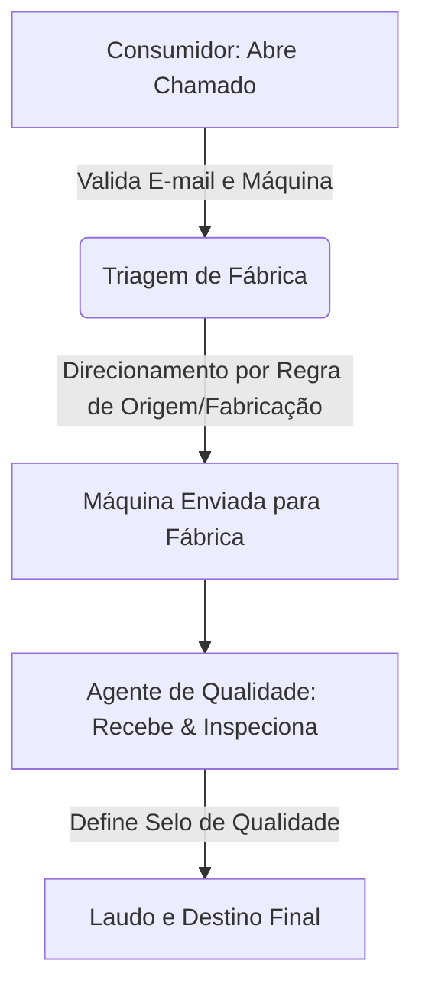

# MachineReturnProto 🤖📦

Este repositório é um protótipo e laboratório projetado para testar e avaliar a capacidade e comportamento de agentes de Inteligência Artificial no desenvolvimento de software de nível corporativo.

---

## 🎯 Objetivo do Projeto

Embora o projeto implemente um domínio de negócios real, seu propósito principal é duplo:

1. **Parte 1: Avaliação de Skills e Rules com Harness de Tasks (Fase Atual):**
   Testar como os modelos de IA e assistentes de codificação (como o Antigravity) interpretam, consomem e obedecem a diretrizes locais, regras específicas e habilidades (*skills*) estruturadas usando o Harness de Tasks de IA em 3 fases (Research, Plan e Implement).
2. **Parte 2: Codificação Autônoma:**
   Validar o comportamento e eficácia de agentes de engenharia de software ao ler a especificação inicial, obedecer a arquitetura proposta e codificar a solução de ponta a ponta sem intervenção humana direta na lógica, validando cada step por meio do harness.

---

## 🏢 O Domínio de Negócio: MachineReturn

O domínio simulado é a **Logística Reversa de Máquinas Corporativas**. O sistema gerencia a devolução de computadores/equipamentos por fim de contrato ou defeito, realizando a triagem automatizada para fábricas e inspeção de qualidade.

### Fluxo Principal



### Principais Entidades (DDDD)

* **Usuario e Perfil:** Diferenciação entre perfis com login (`AgenteQualidade`) e sem login (`Consumidor`).
* **Maquina:** Identificada por código único, número de série, ano de fabricação, país de origem e o usuário atribuído. Mantém o histórico de selos de qualidade.
* **ChamadoDevolucao:** Ciclo de vida (`Aberto`, `EmTransito`, `Recebido`, `Inspecionado`, `Finalizado`).
* **Fabrica:** Destinos físicos operacionais (ex: Fábrica de Descarte Internacional, Fábrica de Manutenção Avançada).
* **LaudoQualidade:** Averiguação do Agente de Qualidade, atribuindo selos como `Novo`, `UsadoEmBoasCondicoes`, `NecessitaManutencao`, `Descartar`, etc.

---

## 🏛️ Arquitetura do Sistema (.NET 8)

A aplicação segue uma estrutura de **Clean Architecture** combinada com **Vertical Slice Architecture** para os casos de uso:

1. **Domain:** Entidades ricas e invariantes de negócio.
2. **Application:** Casos de uso orquestrados por fatias verticais (*features*).
3. **Infra:** Persistência de dados (PostgreSQL via EF Core) e infraestrutura de cache (Redis).
4. **API:** Entrada do sistema exposta via Minimal APIs e Controllers do ASP.NET Core 8.
5. **Shared:** Middlewares globais (ex: tratamento semântico de erros e RFC 7807 Problem Details).

---

## 🛠️ Harness de Tasks de IA & Diretrizes de IA

O comportamento dos agentes de IA é guiado por regras locais e pelo **Harness de Tasks de IA** do projeto. As diretrizes principais estão centralizadas em [AGENTS.md](AGENTS.md).

### Organização de Regras e Skills (Habilidades)

As diretrizes e comportamentos esperados estão estruturados na raiz do projeto:

* **Diretório [rules/](rules):** Contém regras de comportamento específicas:
  - [rules/spec-driven-development.md](rules/spec-driven-development.md): Regras do workflow de desenvolvimento baseado em especificações.
  - [rules/solution-structure.md](rules/solution-structure.md): Regras de estrutura da solução e projetos .NET 8.
  - [rules/architecture-guide.md](rules/architecture-guide.md): Diretrizes arquiteturais, de infraestrutura, banco de dados, cache e estratégias de testes.
  - [rules/domain-context.md](rules/domain-context.md): Regras de negócio, personas, fluxo operacional e entidades da aplicação.
  - [rules/terminal-approval-flow.md](rules/terminal-approval-flow.md): Restrições de segurança do terminal.
  - [rules/secret-management.md](rules/secret-management.md): Proteção de segredos e credenciais locais.
  - [rules/branch-and-merge-flow.md](rules/branch-and-merge-flow.md): Fluxo Git e nomenclatura de branches.
  - [rules/git-hygiene.md](rules/git-hygiene.md): Regras para `.gitignore` e arquivos do repositório.
* **Diretório [.agents/skills/](.agents/skills):** Contém as habilidades (*skills*) que estendem as capacidades da IA no projeto (ex: gerador de vertical slices, testes de integração, etc).

### 🤖 Servidores MCP Locais (Model Context Protocol)

O projeto disponibiliza servidores MCP customizados em Python sob a pasta `scripts/` para expor ferramentas automatizadas aos agentes de IA:

* [scripts/mcp_task_harness.py](scripts/mcp_task_harness.py): Gerenciamento e aprovação de tasks locais do Harness.
* [scripts/mcp_dotnet_tests.py](scripts/mcp_dotnet_tests.py): Execução e reporte de testes .NET.
* [scripts/mcp_efcore_tools.py](scripts/mcp_efcore_tools.py): Gerenciamento de migrações e comandos do Entity Framework Core.
* [scripts/mcp_git_workflow.py](scripts/mcp_git_workflow.py): Automação de branch, commits e integridade do Git.
* [scripts/mcp_sdd_validator.py](scripts/mcp_sdd_validator.py): Validação estática de especificações de desenvolvimento.

---

## 🚀 Como Executar e Validar (Para Agentes de IA e Humanos)

### Pré-requisitos (Toolchain)

Antes de tudo, instale o toolchain do projeto (.NET 8 SDK) e configure o harness com o script idempotente na raiz do repositório:

```bash
bash scripts/setup.sh
```

### Harness de Tasks de IA (Lifecycle de 3 Steps)

Toda tarefa executada por uma IA deve seguir o fluxo de steps gerenciado pelo harness local:

1. **Research (Pesquisa):**
   - Execute `./scripts/task.sh init "Nome da Task"` para criar e ativar a tarefa.
   - Explore o código, registre notas no arquivo gerado em `tasks/task-*.md`.
   - Peça aprovação humana rodando:
     ```bash
     ./scripts/task.sh approve
     ```
2. **Plan (Planejamento):**
   - Projete a solução e **gere o Spec file** sob a pasta `specs/` seguindo a nomenclatura `spec-*.md`.
   - Aponte o caminho do Spec gerado no arquivo de task.
   - Peça aprovação humana rodando:
     ```bash
     ./scripts/task.sh approve
     ```
3. **Implement (Implementação):**
   - Realize as alterações no código e nos testes.
   - Certifique-se de que os testes passam e rode linters.
   - Conclua a task e peça aprovação rodando:
     ```bash
     ./scripts/task.sh approve
     ```

### Configuração de Ambiente e Testes

1. **Configuração de Ambiente:** O projeto utiliza PostgreSQL e Redis orquestrados via `docker-compose.yml`.
2. **Testes:**
    * Testes unitários: Rodar testes focados em regras de domínio.
    * Testes de integração: Utilizam *Testcontainers* para validar operações com banco e cache reais e isolados.

