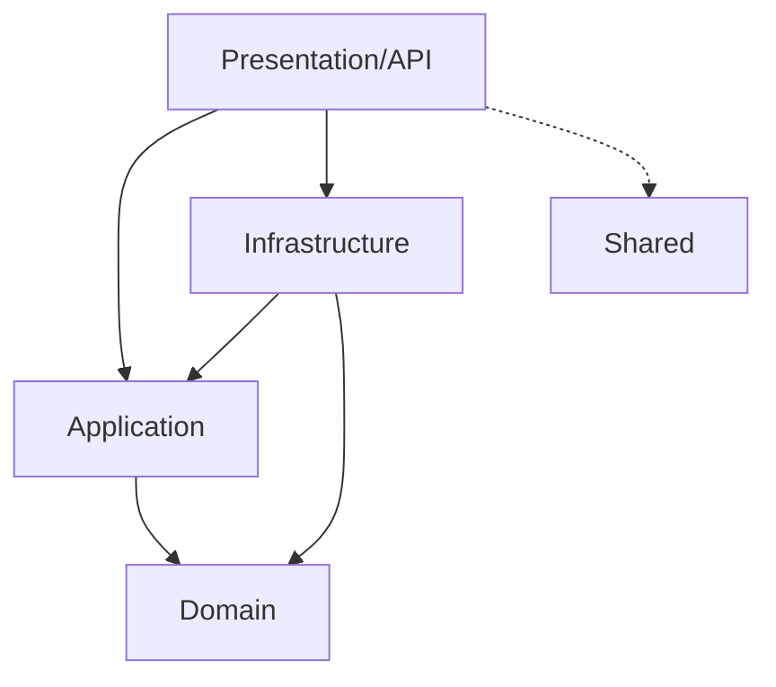

# Estrutura da Solução e Dependência de Projetos

Toda solução desenvolvida sob este blueprint segue as regras clássicas de Clean Architecture, organizada sob um arquivo de solução único (`.sln`) e distribuída em camadas isoladas.

## Arquivo de Solução (`[NomeDoApp].sln`)

Localizado na raiz do projeto, gerencia e agrupa todos os projetos (`.csproj`) da aplicação e dos testes.

## Nomenclatura Padrão de Projetos

Considerando o nome base do sistema (ex: `MachineReturn`), os projetos C# devem seguir o seguinte padrão de nomenclatura:

1. **Camada de Domínio (`[NomeDoApp].Domain.csproj`):**
   - Contém entidades ricas, agregados, value objects, interfaces de repositório e exceções de domínio.
   - **Regra de Dependência:** Zero dependências de outros projetos da solução. Totalmente isolado de bibliotecas de terceiros.
2. **Camada de Aplicação (`[NomeDoApp].Application.csproj`):**
   - Contém os casos de uso (features/vertical slices), Commands, Queries, Handlers e Validadores.
   - **Regra de Dependência:** Depende apenas de `[NomeDoApp].Domain`.
3. **Camada de Infraestrutura (`[NomeDoApp].Infra.csproj`):**
   - Contém persistência (EF Core, DbContext, mapeamentos, migrações) e implementações de clientes (ex: Redis).
   - **Regra de Dependência:** Depende de `[NomeDoApp].Application` e `[NomeDoApp].Domain`.
4. **Camada de Apresentação / API (`[NomeDoApp].API.csproj`):**
   - Contém os endpoints da API (Minimal APIs ou Controllers) e injeção de dependência inicial.
   - **Regra de Dependência:** Depende de `[NomeDoApp].Application`, `[NomeDoApp].Infra` e `[NomeDoApp].Shared`.
5. **Camada Compartilhada (`[NomeDoApp].Shared.csproj`):**
   - Contém middlewares genéricos (como tratamento global de exceções) ou utilitários agnósticos.
   - **Regra de Dependência:** Não deve depender das camadas de negócio da aplicação.
6. **Projetos de Testes:**
   - **Testes Unitários de Domínio (`[NomeDoApp].Domain.UnitTests.csproj`):** Focado no teste de regras atômicas de negócio, invariantes e Value Objects. Depende unicamente de `[NomeDoApp].Domain`.
   - **Testes Unitários de Aplicação (`[NomeDoApp].Application.UnitTests.csproj`):** Focado no teste da orquestração dos Handlers, Commands, Queries e Validadores. Depende de `[NomeDoApp].Application` (e Mocking das dependências).
   - **Testes de Integração (`[NomeDoApp].IntegrationTests.csproj`):** Testes ponta a ponta com containers reais (banco de dados/cache). Depende de `[NomeDoApp].API`, `[NomeDoApp].Infra` e `[NomeDoApp].Application`.

## Fluxo Estrito de Dependências

O fluxo de dependência deve fluir sempre em direção ao Domínio (de fora para dentro):

**Regra Absoluta:** Nunca adicione referências cíclicas ou diretas que contornem essa estrutura (ex: referenciar `API` dentro do `Domain`, ou expor dependências de banco de dados do `Infra` diretamente na camada de `Application`).

## Definições Específicas do Projeto (Alinhamento MR-4)

Ficou acordado para a materialização física da solução:

- **Nome da Solução:** `MachineReturn.sln` (localizado na raiz do repositório).
- **Estrutura de Diretórios:**
  - Código de Produção: Alocado sob `/src` (ex: `/src/MachineReturn.Domain`).
  - Código de Testes: Alocado sob `/tests` (ex: `/tests/MachineReturn.Domain.UnitTests`).
- **Arquitetura da API:** Utilização estrita de **Minimal APIs nativas do .NET 8** no projeto `MachineReturn.API` para favorecer o isolamento de fatias verticais.
- **Ambiente de Desenvolvimento Local (Docker Compose):**
  - PostgreSQL na porta padrão `5432`.
  - Redis na porta padrão `6379`.
  - Chaves confidenciais e credenciais locais gerenciadas via `.NET User Secrets` (com valores de desenvolvimento em `appsettings.Development.json`).
